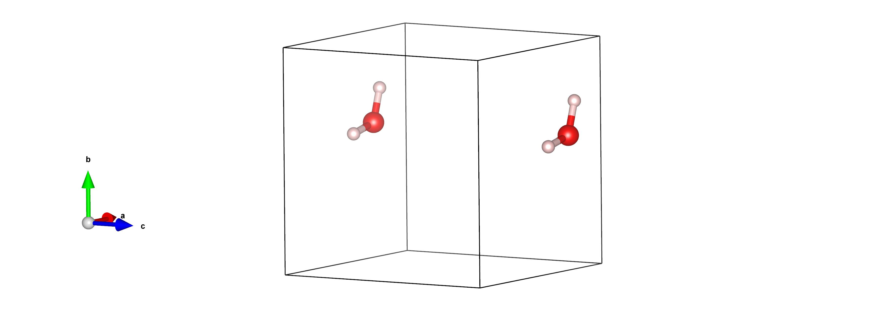
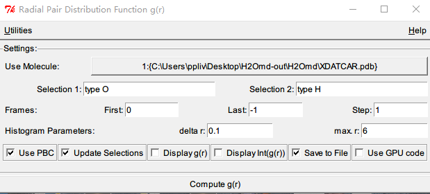
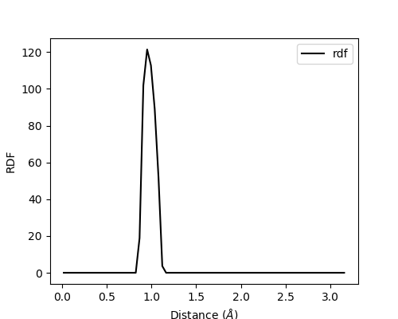
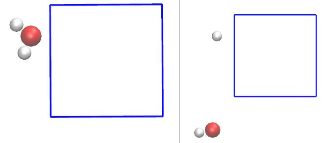
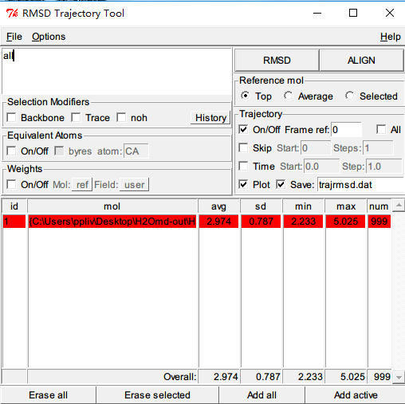
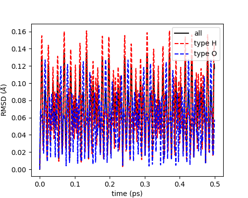

## 第一性原理分子动力学（AIMD）结果分析

与经典分子动力学不同，第一性原理分子动力学不需要提供力场参数，只需要提供原子初始结构，就能根据电子波函数正交化产生的虚拟力，求解牛顿运动方程。在运行优化任务时，VASP生成的XDATCAR记录的是优化步骤的离子构型；在运行AIMD任务时，记录的就是运动轨迹。而现阶段读取XDATCAR轨迹分析性质的后处理软件并不多，能读取的兼容性也并不好。VASPKIT0.72版本之后支持了将XDATCAR转换成通用的多帧PDB文件的功能（504）以便可视化并进行后处理分析。但是并没有提供后处理分析接口，因此我们开发了一个Python脚本`XDATCAR_toolkit.py`，除了实现了选择一定范围内的帧数转换成PDB文件的功能，还可以提取分子动力学模拟过程中的能量，温度并做出变化趋势图。这对判断动力学是否平衡很有帮助。另外本脚本预留了接口，可以调用读取每一帧的晶格信息和原子坐标，以便进行后续扩展编程。此脚本需要安装了`numpy`包的python环境，以及`matplotlib`包以便于画图。

在得到通用轨迹PDB文件后，就可以利用现用的分子动力学后处理软件进行处理分析，比如`VMD`，`MDtraj`，`MD Analysis`， `Pymol`等。本教程将演示通过`VMD`和`MD Analysis`软件包分析`RDF`（径向分布函数）和`RMSD`（均方根偏差），前者可以用来分析结构性质，后者对判断结构是否稳定以及模拟是否平衡很有帮助。

### 将XDATCAR转换成PDB文件
以VASP官网中单个水分子的AIMD模拟为例。模拟的输入文件如下，模拟的步长是0.5fs，模拟步数1000步，模拟时间500fs。脚本和测试例子可以在我的Github仓库(https://github.com/tamaswells/VASP_script/tree/master/XDATCAR_tookit)下载。



<div align='center'><span>图1. 模拟的盒子</span></div>

#### INCAR

```bash
 PREC = Normal    ! standard precision 
 ENMAX = 400      ! cutoff should be set manually
 ISMEAR = 0 ; SIGMA = 0.1

 ISYM = 0         ! strongly recommened for MD
 IBRION = 0       ! molecular dynamics
 NSW = 1000       ! 1000 steps
 POTIM = 0.5      ! timestep 0.5 fs

 SMASS = -3       ! Nose Hoover thermostat
 TEBEG =  2000 ; TEEND = 2000 ! temperature

 NBANDS = 8
```

#### POSCAR

```bash
H2O _2
0.52918   ! scaling parameter
 12 0 0
 0 12 0
 0 0 12
1 2
select
cart
      0.00     0.00     0.00 T T F
      1.10    -1.43     0.00 T T F
      1.10     1.43     0.00 T T F
```

#### KPOINTS

```bash
Gamma-point only
 1        ! one k-point
rec       ! in units of the reciprocal lattice vector
 0 0 0 1  ! 3 coordinates and weight
```

模拟完成后将`XDATCAR_toolkit.py`上传到文件夹中（或者置于环境变量的路径文件夹中并赋予可执行权限即可直接调用命令`XDATCAR_toolkit.py`运行脚本），在shell环境中运行以下命令:

```bash
python XDATCAR_toolkit.py -p -t 0.5  --pbc
```

即可将XDATCAR的全部帧也就是0~499.5fs的轨迹转化成PDB格式。其中`-p`用于开启PDB转换功能，`-t 0.5`用于指定时间步为0.5fs，`--pbc`用于获取基于第一帧演变的连续轨迹。

```bash
Now reading vasp MD energies and temperature.
Now reading vasp XDATCAR.
Total frames 1000, NpT is False
Finish reading XDATCAR.
Selected time-range:0.0~499.5fs
[debug] Now entering function plotfigure.....
```

运行完成后，将会在文件夹内生成`Temperature.dat`，`Energy.dat`，`ENERGY.png`和`XDATCAR.pdb`四个文件，前面两个分别为温度和能量随着模拟时间的的变化数据，第三个是使用`matplotlib`绘制的趋势图（如下图），最后一个是转换得到的轨迹PDB文件，可以用于可视化轨迹，亦可用于后处理分析。`-b`参数用于指定转换从哪一帧开始，`-e`参数用于指定转换到哪一帧结束。经刘锦程博士建议，增加一个`--pbc`的选项，用于处理周期性获取连续的轨迹。当分子穿过盒子边界时，记录真实的位置坐标（尽管它出了边界）而不是从盒子另一边穿入的`ghost`原子的坐标。这对于分析与时间相关性的量（比如RMSD）很有帮助。所谓连续指的是后面的轨迹都是从第一帧演变得到的真实坐标，但是并不能保证第一帧的分子是完整的，由于周期性的缘故，第一帧内摆放的分子可能分处于盒子两侧。李继存老师有篇博文(http://jerkwin.github.io/2016/05/31/GROMACS%E8%BD%A8%E8%BF%B9%E5%91%A8%E6%9C%9F%E6%80%A7%E8%BE%B9%E7%95%8C%E6%9D%A1%E4%BB%B6%E7%9A%84%E5%A4%84%E7%90%86/)讲的很明白，可以参考。如果发现第一帧内分子不完整，可以通过添加`-i 1`参数将分子向第一个原子靠近平移以获得完整的分子。如果发现不理想，可以通过调整`-i`的参数获得完整的分子。
 <div align="center"></div>

<div align='center'><span>图2. 温度和系统能量的变化趋势图</span></div>

### RDF径向分布函数分析

得到PDB文件后，可以使用`VMD`，`MD Analysis`等分子动力学后处理软件进行分析。

#### 使用VMD分析工具分析

打开VMD，将PDB文件拖入显示窗口，在主菜单`VMD Main`中选择`Extensions-Analysis-Radial Pair Distribution Function g(r)`，选择分析H(type H)在O(type O)周围的概率分布。值得注意的是分析RDF时,横坐标也就是max r不能超过盒子最小边长的一半，也就是得满足最小映像约定。如图4所示，在计算RDF时，如果max r的取值大于盒子最小边长的一半，就有可能重复算到一个粒子和它的映像粒子，这使得程序的周期性判断失准。将生成的dat文件的第一列和第二列作图即可得到RDF图。



<div align='center'><span>图3. VMD中计算RDF</span></div>

 <div align="center"></div>


<div align='center'><span>图4. 最小映像约定示意图</span></div>

#### 使用 MD Analysis分析 RDF

[MD Analysis](https://www.mdanalysis.org/)是一个成熟的分子动力学后处理软件，使用Python编写，开源。其教程不仅步骤详细还会给出背景理论知识。可以通过conda或者pip工具在线安装。

```bash
conda config --add channels conda-forge
conda install mdanalysis
#or
pip install --upgrade MDAnalysis
```

RDF分析的介绍和使用方法在网页(https://www.mdanalysis.org/docs/documentation_pages/analysis/rdf.html#radial-distribution-functions-mdanalysis-analysis-rdf)上查看。使用以下的脚本得到在O原子周围找到H原子的概率，并调用`matplotlib`绘制RDF图。在1.0 $Å$  处出现一个尖峰，也就是对应了O-H键的平衡键长（0.96$Å$）。

```python
import MDAnalysis
import MDAnalysis.analysis.rdf
import matplotlib.pyplot as plt

u = MDAnalysis.Universe('XDATCAR.pdb', permissive=True)
g1= u.select_atoms('type O')
g2= u.select_atoms('type H')
rdf = MDAnalysis.analysis.rdf.InterRDF(g1,g2,nbins=75, range=(0.0, min(u.dimensions[:3])/2.0))
           
rdf.run()

fig = plt.figure(figsize=(5,4))
ax = fig.add_subplot(111)
ax.plot(rdf.bins, rdf.rdf, 'k-',  label="rdf")

ax.legend(loc="best")
ax.set_xlabel(r"Distance ($\AA$)")
ax.set_ylabel(r"RDF")
fig.savefig("RDF_all.png")
#plt.show()
```



<div align='center'><span>图5. RDF_O_H</span></div>

### RMSD均方根偏差分析

#### VMD分析RMSD

确保使用了`-pbc`参数以获取**连续的轨迹**，将生成的`XDATCAR.pdb`文件拖入显示窗口。如图6右所示，第一帧内水的三个原子不在同一个镜像内，分子不完整。在进行RMSD分析时，尽管轨迹是连续的，但是在对齐分子时就会出现问题。因此在本例中需要选择第一个原子作为中心将分子平移完整，在图6左中，分子已经在同一个镜像中了。

```bash
python XDATCAR_toolkit.py -p -t 0.5  --pbc -i 1
```




<div align='center'><span>图6. 完整和不完整的水分子</span></div>

将重新生成的PDB文件拖入显示窗口，在主菜单`VMD Main`中选择`Extensions-Analysis-Analysis-RMSD Trajectory Tool`，在计算RMSD前必须先做`Align`（对齐），这会使得每一帧结构进行平移、旋转来与参考帧的结构尽可能贴近，从而使得RMSD最小化。**刘锦程提到研究生物法分子的RMSD时需要对齐操作，而研究小分子时不需要对齐分子。**



<div align='center'><span>图7. VMD中计算RMSD</span></div>

把左上角文本框里的默认的`Protein`改成`all`（代表所有原子都纳入考虑），然后把`noh`复选框的勾去掉（否则将忽略氢原子）。然后点右上角的`ALIGN按钮`，此时所有帧的结构就已经对齐了。本例中演示以模拟的第一帧为参考，分析氧原子位置的均方根偏差。因此在`Reference mol`那里选`top`作为参考结构，左上角文本框由`all`改为`type O`（代表计算O原子的RMSD），然后勾上`Plot`复选框，最后点击`RMSD`按钮即可得到O原子的RMSD图。在`File`菜单栏可以选择导出dat数据。

 <div align="center"></div>

<div align='center'><span>图8. VMD中未对齐轨迹计算的RMSD</span></div>

 <div align="center"></div>

<div align='center'><span>图9. VMD中对齐了轨迹后计算的RMSD</span></div>


#### 使用 MD Analysis分析 RMSD

RMSD分析的介绍和使用方法在网页(https://www.mdanalysis.org/docs/documentation_pages/analysis/rms.html?highlight=average上查看。使用以下的脚本可以分别得到所有原子，氢原子，氧原子的RMSD，并调用`matplotlib`绘制RMSD图。网页中有一段话（Note If you use trajectory data from simulations performed under **periodic boundary conditions** then you *must make your molecules whole* before performing RMSD calculations so that the centers of mass of the selected and reference structure are properly superimposed.）也就是在计算RMSD的时候选择的分子必须是**完整的**，不能分处于盒子的两边。这与我们之前的描述是一致的。`MD Analysis`默认对齐了分子。

使用以下脚本可以绘制对齐了轨迹后所有原子，氧原子和氢原子的RMSD。

```bash
import MDAnalysis
import MDAnalysis.analysis.rms
import matplotlib.pyplot as plt

u = MDAnalysis.Universe('XDATCAR.pdb', permissive=True)
ref = MDAnalysis.Universe('XDATCAR.pdb', permissive=True)     # reference (with the default ref_frame=0)
ref.trajectory[0] #use first frame as reference
R = MDAnalysis.analysis.rms.RMSD(u, ref,
           select="all",         # superimpose on whole backbone of all atoms # align based on all atoms
           groupselections=["type H","type O"],
           filename="rmsd_all.dat",center=True)#,   # CORE
timestep=0.0005  #0.5fs from fs to ps as Reader has no dt information, set to 1.0 ps          
R.run()
rmsd = R.rmsd.T   # transpose makes it easier for plotting
time = rmsd[1]*timestep

fig = plt.figure(figsize=(5,4))
ax = fig.add_subplot(111)
ax.plot(time, rmsd[2], 'k-',  label="all")
ax.plot(time, rmsd[3], 'r--', label="type H")
ax.plot(time, rmsd[4], 'b--', label="type O")
ax.legend(loc="best")
ax.set_xlabel("time (ps)")
ax.set_ylabel(r"RMSD ($\AA$)")
fig.savefig("rmsd_md_analysis.png")
```




<div align='center'><span>图10. MD Analysis计算的对齐了轨迹后计算的所有原子，H原子和O原子的RMSD</span></div>


